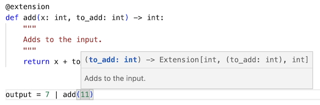

# extensionmethods

Mimics C#-style extension methods in Python.

`extensionmethods` is a tiny package that lets you “attach” functions to existing types without modifying their source code, enabling method-like syntax, better chaining, and cleaner separation of optional dependencies.

- [extensionmethods](#extensionmethods)
  - [Example usage](#example-usage)
  - [Type safety and IDE integration](#type-safety-and-ide-integration)
  - [Installation](#installation)
  - [Why use extension methods?](#why-use-extension-methods)
    - [Readability through chaining](#readability-through-chaining)
    - [Modularity and dependency isolation](#modularity-and-dependency-isolation)
  - [Known caveats](#known-caveats)
    - [Uses the `|` operator (`__ror__`)](#uses-the--operator-__ror__)
  - [License](#license)


## Example usage

In C#, you can add methods to existing types:

```csharp
public static class IntExtensions
{
    public static int Double(this int x)
    {
        return x * 2;
    }
}

int result = 7.Double();
```

You get method syntax without modifying `int`.

With the `extensionmethods` package you can achieve similiar functionality like so:

```python
from extensionmethods import extension

@extension
def double(x: int) -> int:
    return x * 2

result = 7 | double()
print(result)  # 14
```

With parameters:

```python
@extension
def add_then_multiply(x: int, to_add: int, to_multiply: int) -> int:
    return (x + to_add) * to_multiply

result = 7 | add_then_multiply(11, 3)
print(result)  # 54
```

The value on the left side becomes the first argument of the function.

## Type safety and IDE integration

The extension methods are type-aware, based on the type of their first parameter. Type checkers and editors can detect incorrect usage:

```python
"hello" | double()  # type error
```

Your IDE (e.g. VS Code) can flag this because the extension has its first argument of type `int`, not `str`.

Furtermore, the extension methods support docstrings and code suggestions in your IDE:



## Installation

Using **pip**:

```bash
pip install extensionmethods
```

Using **uv**:

```bash
uv pip install extensionmethods
```

## Why use extension methods?

### Readability through chaining

Instead of nested calls:

```python
result = normalize(scale(center(data)))
```

You can express the same flow step-by-step:

```python
result = data | center() | scale() | normalize()
```

This reads left-to-right and mirrors how data is conceptually transformed.

### Modularity and dependency isolation

Suppose you maintain a core class:

```python
class Dataset:
    ...
```

You want export helpers:

- `to_pandas()`
- `to_numpy()`
- `to_torch()`

If you put these methods directly on `Dataset`, your core package must depend on `pandas`, `numpy`, and `torch`.

Instead, keep the core dependency-free:

```python
# core package
class Dataset:
    ...
```

Then provide optional extensions:

```python
# dataset_pandas package
import pandas as pd
from extensionmethods import extension
from core import Dataset

@extension(to=Dataset)
def to_pandas(ds: Dataset) -> pd.DataFrame:
    ...
```

Usage:

```python
import dataset_pandas  # registers the extension

df = dataset | to_pandas()
```

Now:

- The core package has zero heavy dependencies
- Users only install what they need
- Functionality stays logically grouped

## Known caveats

### Uses the `|` operator (`__ror__`)

The system works by overriding the right-side bitwise OR operator.

```python
result = value | extension_call()
```

This only works if the left-hand type does not fully consume the `|` operator itself.

For example, sets already use `|`:

```python
{1, 2} | {3}   # set union
```

If a type defines its own `__or__` in a way that prevents fallback to `__ror__`, the extension method will not run.

## License

This project is licensed under the MIT License. See the `LICENSE` file for details.
